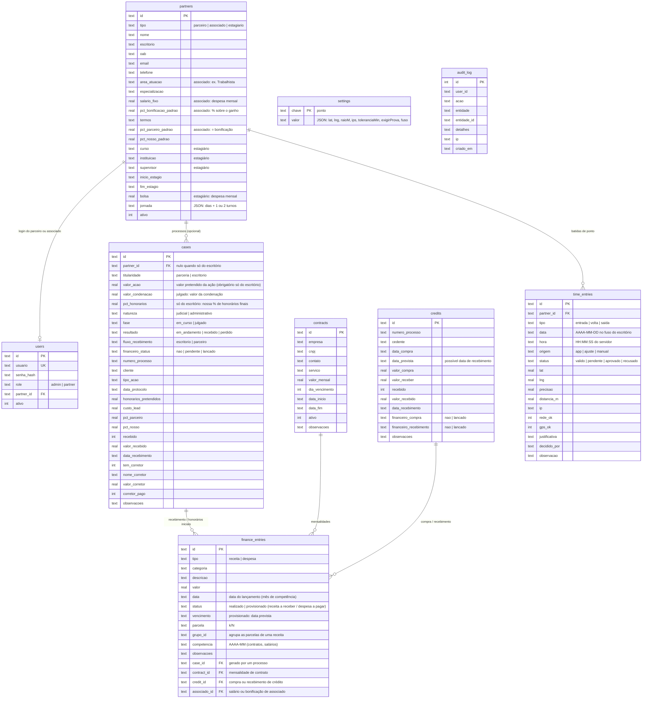
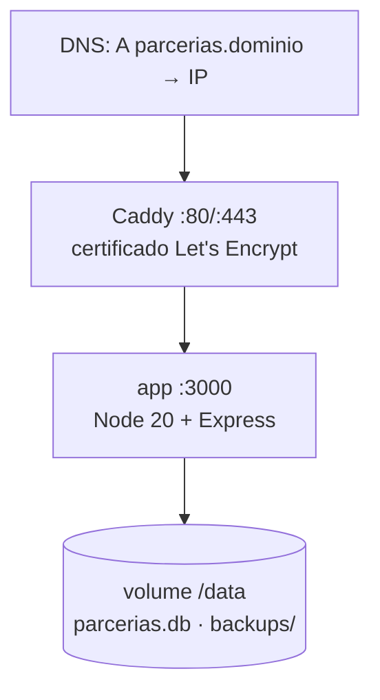

# Arquitetura — Gestão de Parcerias Costa de Araújo

## 1. Visão geral

O sistema tem **uma única interface** (`public/`) e **duas formas de guardar dados**, escolhidas
por qual adaptador é carregado antes de `app.js`:

```mermaid
flowchart LR
  subgraph Navegador
    UI[app.js — telas e regras de cálculo]
    UI --> API{{window.ParceriasAPI}}
  end
  API -->|api-rest.js| REST[/API REST\n/api/*/]
  API -->|api-claude.js| CDB[(Banco do artifact\nclaude.use('db'))]
  REST --> EX[Express + Node 20]
  EX --> SQ[(SQLite\nparcerias.db)]
  EX --> AUD[(audit_log)]
  CADDY[Caddy — HTTPS automático] --> EX
```

- **Hoje (artifact no Claude):** `api-claude.js` grava nas coleções do banco do artifact. As
  regras de acesso são declaradas na publicação (`config` e `partners` só o proprietário
  escreve; `credits`, `finance` e `contracts` só o proprietário lê e escreve).
- **Site próprio:** `api-rest.js` conversa com o servidor Node deste repositório, que faz a
  autenticação de verdade (bcrypt + cookie de sessão) e aplica o escopo por papel no servidor.

`app.js` não sabe qual dos dois está por baixo. Isso permite migrar sem reescrever a tela e,
no futuro, trocar o banco (SQLite → PostgreSQL) mexendo só em `server/`.

## 2. Contrato do adaptador de dados

```ts
interface ParceriasAPI {
  mode: 'rest' | 'claude';
  features: { export: boolean; changePassword: boolean };
  init(): Promise<{ ok, message?, configured, canSetup, canResetAdmin, session, canWrite }>;
  login(usuario, senha, lembrar): Promise<Session>;   // lança Error(message)
  logout(): Promise<void>;
  setupAdmin(usuario, senha): Promise<Session>;
  changePassword(atual, nova): Promise<void>;
  subscribe(onData: (d: { partners, cases, credits, finance, contracts, ponto, pontoConfig, loaded, sessionLost? }) => void): () => void;
  createCase(d, opts) / updateCase(id, d, opts) / deleteCase(id);        // opts: lancarFinanceiro, lancamentos, statusAtual
  createPartner(d, senha) / updatePartner(id, d) / setPartnerPassword(id, senha) / setPartnerActive(id, ativo);
  createCredit(d, opts) / updateCredit(id, d, opts) / deleteCredit(id);  // opts: lancarCompra, lancarRecebimento, lancamentos
  createFinance(d) / updateFinance(id, d) / deleteFinance(id);
  createContract(d) / updateContract(id, d) / deleteContract(id);
  punch({ tipo, lat, lng, precisao }) / requestAdjust({ data, hora, tipo, justificativa });        // associados e estagiários
  manualPunch(d) / decidePunch(id, decisao, obs) / deletePunch(id) / getPontoConfig() / savePontoConfig(c) / myIp() / loadPonto(de, ate);
  exportCSV(filename, csvText): Promise<boolean>;
}
type Session = { role: 'admin' | 'partner'; tipo: 'admin' | 'parceiro' | 'associado' | 'estagiario'; partnerId?: string; usuario: string; nome: string };
```

Erros de escrita chegam como `Error` com `.code` ∈ `read_only | auth | quota | rate | validation | unknown`;
`app.js` traduz cada código em uma mensagem para o usuário.

Atualização em tempo (quase) real: no artifact, `onSnapshot`; no site, `api-rest.js` recarrega
`/api/bootstrap` a cada 20 s (só com a aba visível), ao voltar para a aba e após cada gravação
(`reload()` espera um poll em andamento terminar e lê de novo, para nunca mostrar dados anteriores à gravação).
Se um dia for necessário algo instantâneo, o ponto de troca é só `subscribe()` (ex.: SSE).

## 3. Modelo de dados (SQLite)



Convenções: ids são UUID (texto) — os mesmos ids do artifact podem ser preservados numa
migração; datas em ISO `AAAA-MM-DD`; valores em `REAL` com duas casas; booleanos em `INTEGER`.
`db.js` converte `snake_case` (SQL) ↔ `camelCase` (front-end) em um só lugar (`partnerRow`,
`caseRow`, `creditRow`, `financeRow`, `contractRow`).

No artifact, as mesmas entidades vivem nas coleções `config/settings`, `partners/{id}`,
`cases/{id}`, `credits/{id}`, `finance/{id}` e `contracts/{id}`, com os campos já em camelCase.
`credits`, `finance` e `contracts` têm leitura e escrita restritas ao proprietário do artifact.

### Os quatro braços do escritório

| Braço | Entidade | Onde entra no Financeiro |
|---|---|---|
| **Processos e parcerias** | `cases` com `titularidade = parceria` (parceiro ou associado) ou `escritorio` (sem divisão) | receita do recebimento (+ repasse/bonificação); receitas digitadas no Financeiro com "processo relacionado" (ex.: honorários iniciais) |
| **Compra de créditos** | `credits` | despesa *Compra de créditos* na aquisição; receita *Créditos comprados* no recebimento |
| **Contratos com empresas** | `contracts` | uma receita *Contratos com empresas* por mês (`contract_id` + `competencia`) |
| **Honorários próprios e outras** | lançamentos sem vínculo | receitas digitadas à mão (ex.: honorários iniciais avulsos) |

### Equipe e controle de horário dos colaboradores (ponto)

Três tipos de pessoa vivem na tabela `partners`, cada uma com login próprio (`users.role = partner`;
o `tipo` vai na sessão): **parceiro** (vê e grava só os próprios processos), **associado** (processos
+ aba *Meu ponto*) e **estagiário** (só *Meu ponto*; `denyIntern` bloqueia `/api/cases`). A
administração cadastra os três em *Parceiros e associados*; a bolsa do estagiário e o salário do
associado entram no Financeiro pela mesma rotina (`pendingSalaries`/`postSalaries`, categorias
*Estagiários (bolsa)* e *Advogados associados (salário)*).

**Jornada.** `jornada = { dias: [1..5], blocos: [[ini, fim], [ini, fim]] }`, com 1 ou 2 turnos.
Padrões: associado *integral* (08:00–12:00 e 14:00–17:30 → 3 batidas: entrada, volta do almoço e
saída) e estagiário *manhã* (08:00–12:00 → 2 batidas); há também *tarde* (14:00–17:30) e
personalizado. Horas do 1º turno contam da entrada até o fim previsto do turno (quando há 2
turnos) ou até a saída; as do 2º, da volta até a saída. Atraso = entrada (ou volta) além do início
previsto + tolerância (20 min por padrão; configurável). Falta = dia útil da jornada sem batida;
*incompleto* = dia com batida faltando. Faltas só contam dentro do período do estágio e a partir
do cadastro da pessoa.

**Prova de presença ("cerca virtual + rede do escritório").** Ao bater, o aparelho envia
latitude/longitude/precisão; o servidor grava o **horário do servidor** no fuso configurado e
avalia: `rede_ok` (IP de origem na lista de IPs do escritório; aceita `prefixo*`) e `gps_ok`
(distância ≤ raio + até 50 m de imprecisão). Válida se qualquer um dos dois; senão **não é
recusada** — fica `pendente` para a administração aprovar/recusar, com distância, IP e precisão
registrados. Sem nada configurado, a batida vale sem prova e a tela avisa. Não se repete a mesma
batida no dia. "Esqueci de bater" gera um pedido de ajuste (`origem = ajuste`, `pendente`,
justificativa obrigatória); a administração pode ainda lançar batida manual (`origem = manual`,
já aprovada). Nenhuma batida é editada: tudo fica na tabela e no `audit_log`.

**Telas.** *Meu ponto* (mobile first): relógio, próxima batida da jornada em um botão, status da
prova ("você está a 40 m do escritório ✓" / "na rede do escritório ✓" / fora do raio), espelho do
mês e saldo. *Ponto* (administração): quem está no escritório agora, atrasos e ausências do dia,
pendências com Aprovar/Recusar, resumo mensal por pessoa (dias úteis, presenças, faltas, atrasos,
horas, saldo), espelho dia a dia, exportação CSV, batida manual e configuração (coordenadas com
"usar minha localização", raio, IPs com "adicionar meu IP", tolerância, fuso, exigir prova).

**No artifact** a prova é só GPS (não há servidor para ver o IP) e o horário é o do aparelho;
`config/ponto` só o proprietário grava; a coleção `ponto` é lida/gravada por quem tem acesso. O
adaptador assina só do mês anterior em diante (`where data >=`) e busca meses antigos sob demanda.

**Limites legais (resumo).** Para estagiários (Lei 11.788/2008) e associados o controle interno
basta. Para empregados CLT, usar o sistema como registro oficial de jornada esbarra na Portaria
MTE 671/2021 (REP-C/A/P, AFD, comprovante): aí o caminho é um REP físico com importação do AFD,
ou o sistema como controle alternativo onde a convenção coletiva permitir. Geolocalização é dado
pessoal: colha ciência/consentimento e defina retenção.

Na visão geral, `armOf(lancamento)` classifica cada receita por esse vínculo (`caseId` → processos,
`contractId` → contratos, `creditId` → créditos, senão próprio) e o seletor "Todos os braços /
Processos e parcerias / Compra de créditos / Contratos com empresas" troca o painel.

**Parceiro × associado.** O advogado *parceiro* tem escritório próprio e divide os honorários por
percentual (`pct_parceiro` / `pct_nosso`). O *associado* trabalha para o escritório: tem
`area_atuacao` (exibida como "ADVOGADO ASSOCIADO …"), `salario_fixo` (despesa mensal
*Advogados associados (salário)* por competência) e `pct_bonificacao_padrao` (% sobre o ganho de
cada processo, lançada como despesa *Bonificação de associado*). Os campos de divisão no processo
são opcionais e sobrescrevem o padrão do cadastro.

**Pagamento mensal no Financeiro (v12).** O salário do associado e a bolsa do estagiário são
provisionados pelo próprio cadastro: a seção "Pagamento mensal no Financeiro" (só administração)
gera um lançamento por mês — `associado_id` da pessoa, `competencia`, `vencimento` no dia escolhido,
`grupo_id = sal-<id>` — de "a partir de" até "até" (`payPlan()`/`payEntriesFor()` em `app.js`,
gravação em lote). Meses com vencimento até hoje nascem `realizado`; os seguintes, `provisionado`
(aparecem em **Contas a pagar**). Competências que a pessoa já tem são puladas (idempotente com o
botão "lançar salários e bolsas" do mês, que continua existindo para quem não foi provisionado), e
o estágio respeita `inicio_estagio`/`fim_estagio`. Para não contar em dobro com lançamentos
globais feitos à mão (mesma categoria, sem `associado_id`), a tela avisa quando há despesa dessa
categoria sem pessoa no período e sugere começar no mês seguinte; no cadastro novo o padrão é
começar no mês atual, na edição no mês seguinte ao último já lançado. Ao alterar o salário/bolsa
de quem já tem meses a pagar, a tela oferece atualizar esses meses para o novo valor (os pagos não
mudam); ao desativar a pessoa, oferece excluir os meses a pagar. "Provisionar salários e bolsas"
na aba de parceiros faz o mesmo para todos os ativos de uma vez (pré-marcando quem não tem meses a
pagar), e o cartão de cada associado/estagiário mostra até quando está provisionado.

**Processo só do escritório.** Sem parceiro (`partner_id` nulo, 100 % nosso). Em curso, guarda o
**valor pretendido da ação** e **nossa % de honorários finais**; os *honorários previstos*
(`honorarios_pretendidos`) são calculados como `valor_acao × pct_honorarios / 100`, mas podem ser
digitados à mão (o servidor só calcula quando o valor não vem informado). Ao marcar **Julgado**,
informa-se o **valor da condenação** e os honorários passam a ser calculados sobre ele; em
**Finalizado e recebido**, informa-se *quanto recebemos* (`valor_recebido`), que é o que entra no
Financeiro. Os **honorários iniciais** não fazem parte do processo: são receita do Financeiro
(categoria *Honorários iniciais*, à vista ou parcelada), com o campo opcional "processo relacionado"
(`case_id`) para ficarem vinculados ao processo.

**Base de cálculo dos honorários finais (`base_honorarios`).** Em qualquer processo, os honorários
de êxito podem ser: *valor_causa* (% sobre o valor pretendido da ação; julgado, % da condenação),
*reducao_debito* (**defesa do executado**: % sobre a redução conseguida no débito — `valor_debito`
cobrado na execução − `valor_devido` que entendemos devido; julgado, − `valor_reconhecido` na
decisão) ou *fixo* (valor combinado, digitado). O servidor calcula `honorarios_pretendidos` quando
não vier informado; a tela sugere a base "redução do débito" para tipos de ação com "executado /
embargos / impugnação" e marca o processo com a etiqueta EXECUTADO. Processos de parceria
anteriores à v10 ficam como *fixo*. **Honorários iniciais** pagos pelo cliente ficam em
`honorarios_iniciais` (informativo); o dinheiro entra pelo Financeiro — a administração lança a
receita *Honorários iniciais* vinculada ao processo (à vista ou parcelada) a partir do próprio
cadastro ("Lançar no Financeiro ao salvar" / "Lançar agora"), e a tabela avisa quando há valor
informado ainda não lançado.

**Valor da condenação em qualquer processo.** O campo `valor_condenacao` vale para todos os
processos quando julgados (opcional nas parcerias, onde a divisão continua incidindo sobre os
honorários); em curso, o valor pretendido da ação é opcional nas parcerias.

**Honorários sucumbenciais (v11).** O número da decisão — `valor_condenacao`, o **valor total da
condenação** — normalmente já inclui os honorários de sucumbência, que são **só dos advogados**.
Por isso o processo guarda, separado, `honorarios_sucumbenciais` (quanto daquele total é
sucumbência). A **condenação líquida** (`valor_condenacao − honorarios_sucumbenciais`) é a base dos
honorários contratuais (`honorarios_pretendidos`, calculados como `% × condenação líquida` na base
*valor_causa*); os sucumbenciais entram por fora. Divisão própria: `pct_sucumb_parceiro` — padrão
**50 % na parceria** (metade de cada um), **0 % quando o processo é só do escritório** (100 %
nosso); no associado a tela sugere a mesma % da bonificação; editável por processo. Os
"honorários pretendidos" exibidos na tela são contratuais + sucumbenciais. Ao marcar **Finalizado e
recebido** — mesmo com o processo ainda "em curso" — a tela pergunta, naquele momento, o valor total
da condenação, quanto dele é sucumbência, e quanto recebemos de cada parte: `valor_recebido` é o
total que entrou e `sucumb_recebido` a fatia de sucumbenciais; o servidor aceita esses campos quando
`fase = julgado` **ou** `resultado = recebido` (zera os sucumbenciais fora disso) e recusa
sucumbenciais maiores que a condenação total ou recebidos maiores que o total recebido. O repasse ao
parceiro/bonificação sai de `contratual_recebido × pct_parceiro + sucumb_recebido ×
pct_sucumb_parceiro`, e os lançamentos do Financeiro registram a composição nas observações
("Honorários contratuais R$ X + honorários sucumbenciais R$ Y"; na despesa de repasse, "a % de X +
b % de Y").

**Créditos provisionados.** Receitas com `status = provisionado` (parcelas futuras), mensalidades
de contratos ainda não registradas, créditos comprados não recebidos e a **parte do escritório
prevista nos processos em andamento** (`metrics(c).nossaParte`: honorários previstos × nossa %)
formam a caixa "Créditos provisionados" (`provisionedItems()` em `app.js`). Parcelas, mensalidades
e créditos têm check para baixa direta (parcela → `status = realizado` na data informada;
mensalidade → nova receita; crédito → marcado como recebido e lançado). Os processos aparecem em
seção própria, como estimativa e sem check: o botão "Informar resultado" abre o processo, onde a
baixa acontece (Julgado → valor da condenação → Finalizado e recebido → quanto recebemos), gerando
a receita no Financeiro. Totais, gráficos e resultado do Financeiro consideram só o realizado.

**Despesas recorrentes e contas a pagar (v12).** No formulário de lançamento, a forma
**Recorrente** (botão "+ Despesa recorrente" ou a opção dentro de "+ Despesa"/"+ Receita") gera um
lançamento por mês entre o **primeiro** e o **último mês** informados (pode começar em meses
passados e ir para o futuro; até 120 meses), no **dia do vencimento** escolhido (limitado ao último
dia de cada mês), todos com o mesmo `grupo_id` (prefixo `r`), `competencia = AAAA-MM`,
`vencimento` e a descrição "nome — mês/ano". Meses com vencimento até hoje nascem `realizado`
(quando "meses já vencidos entram como pagos" está marcado — é o padrão, para reconstruir o
histórico); os seguintes nascem `provisionado`. A gravação é em lote (`POST /api/finance/lote`, uma
transação; no artifact, um documento por mês). Despesas provisionadas formam a caixa **Contas a
pagar** (`payables()`/`openPayablesSheet()`), separada dos créditos provisionados (que agora só
consideram receitas): baixa em lote com a data do vencimento de cada conta ou uma data única; na
lista aparecem como "A pagar"/"Vencida". Editar um lançamento de um grupo oferece **aplicar o novo
valor aos seguintes ainda a pagar/a receber** (reajuste) e excluir oferece **excluir também os
seguintes** (encerra a recorrência) — ambos via `POST /api/finance/grupo/:grupoId` com `acao =
valor | excluir` e `desde` (só atinge lançamentos `provisionado` com vencimento posterior). Um
lançamento avulso continua podendo receber qualquer data passada: a "Data" é livre.

### Regras de cálculo (iguais nas duas versões, em `app.js`)

| Grandeza | Fórmula |
|---|---|
| Base da divisão | recebido: `valorRecebido`; em andamento: `honorariosPretendidos` (valor pretendido ou da condenação, conforme a fase); perdido: 0 |
| Parte do parceiro / do escritório | `base × pct / 100` |
| A receber | Σ `honorariosPretendidos` dos processos não recebidos |
| Resultado líquido | Σ nossa parte recebida − Σ custo dos leads − Σ valores de corretor |
| Honorários previstos (processo só do escritório) | `valorAcao × pctHonorarios / 100` em curso; `valorCondenacao × pctHonorarios / 100` quando julgado (editável) |
| Provisionado de um processo em andamento | `nossaParte` = honorários previstos × `pctNosso / 100` (100 % no processo só do escritório) |
| Parcelamento de receita | `N` parcelas mensais a partir do 1º vencimento; valor = `total / N` (centavos ajustados na última); 1ª pode nascer realizada, as demais `provisionado` |
| Receita em atraso / despesa vencida | `status = provisionado` e `vencimento < hoje` |
| Recorrência | um lançamento por mês de `primeiro` a `último`, no dia `D` (ou último dia do mês); `vencimento ≤ hoje` → `realizado` (se "já pagos"), senão `provisionado`; mesmo `grupo_id` |
| Mensalidade em aberto (contrato) | mês de vigência ≤ mês atual sem receita com `contractId + competencia` |
| Lucro previsto (crédito) | `valorReceber − valorCompra` |
| Lucro realizado (crédito) | `valorRecebido − valorCompra` (só quando recebido) |
| Crédito atrasado | não recebido e `dataPrevista < hoje` |
| Linha do tempo de recebimentos | soma de `valorReceber` dos créditos não recebidos, por mês da `dataPrevista`; colunas extras para **Atrasados** (data já passou), **Depois** (além de 18 meses) e **Sem data** |
| Resultado do mês (financeiro) | Σ receitas − Σ despesas do mês (só `realizado`); **margem** = resultado ÷ receitas; **acumulado** = soma dos resultados até o mês |

### Integração processo → financeiro

Quando um processo passa a **Finalizado e recebido**:

| Situação | Lançamentos gerados (data = data do recebimento, `case_id` = processo) |
|---|---|
| Parceiro — o escritório recebeu o total | receita do valor total (categoria *Alvará de honorários finais* se julgado, senão *Honorários de parceria*) **+** despesa *Repasse a parceiro* com a parte do parceiro |
| Parceiro — o parceiro recebeu e repassou | receita apenas da parte do escritório |
| Associado | receita do valor total (*Alvará…* ou *Honorários de êxito*) **+** despesa *Bonificação de associado* (`associado_id`) com a % do associado |
| Só do escritório | receita do valor total, sem repasse |

- O **administrador** lança na hora (opção marcada por padrão ao salvar). O **parceiro** só informa: o processo fica com `financeiro_status = pendente` e o painel do escritório mostra o aviso "recebimentos aguardando lançamento", com atalho para confirmar.
- Salvar de novo um processo já lançado não duplica nada. Voltar para *Em andamento* ou *Perdido* remove os lançamentos vinculados. Excluir o processo mantém os lançamentos, sem o vínculo.
- No site a regra roda no servidor (`settleFinance`, em `routes/cases.js`, dentro da mesma transação); no artifact, no adaptador `api-claude.js`, que só consegue gravar em `finance` quando o usuário é o proprietário.

Esquema versionado: `schema_version` guarda a versão atual e `db.js` aplica migrações numeradas
ao subir (v2 acrescentou `credits.data_prevista`; v3, a tabela `finance_entries`; v4, `cases.natureza`; v5, fase/situação do processo e vínculo com o financeiro; v6, contratos, tipo/área/salário/bonificação dos parceiros, vínculos do financeiro com contrato/crédito/associado e situação dos créditos; v7, `partner_id` anulável, titularidade e receitas provisionadas/parceladas; v8, `valor_condenacao` e `pct_honorarios` — a coluna `pct_honorarios_iniciais` da v7 é removida; v9, estagiários (curso, instituição, supervisor, estágio, bolsa, jornada), `time_entries` e `settings`; v10, base dos honorários, valores da execução e honorários iniciais; v11, honorários sucumbenciais — `honorarios_sucumbenciais`, `pct_sucumb_parceiro`, `sucumb_recebido`). Um banco antigo é atualizado sozinho — a v7 recria a tabela `cases` preservando as linhas, por isso faça backup antes de atualizar.

## 4. API REST

Todas as rotas em `/api`, JSON, cookie de sessão `pc_sessao`. Escritas exigem o cabeçalho
`X-Requested-With: fetch` (proteção CSRF).

| Método e rota | Quem | O que faz |
|---|---|---|
| `GET /session` | público | `{ configured, session }` |
| `POST /setup` | público, só enquanto não houver admin | cria o administrador e abre sessão |
| `POST /login` · `POST /logout` | público / autenticado | limite de 20 tentativas por IP a cada 15 min |
| `POST /password` | autenticado | troca a própria senha (exige a atual) |
| `GET /bootstrap` | autenticado | tudo que a tela precisa, já no escopo do papel |
| `GET/POST /cases` · `PUT/DELETE /cases/:id` | autenticado | parceiro: só os próprios; admin: todos. `lancarFinanceiro: true` no corpo (só admin) gera os lançamentos do recebimento |
| `GET/POST /partners` · `PUT /partners/:id` · `POST /partners/:id/password` · `POST /partners/:id/ativo` | admin | gestão de parceiros, associados e estagiários (`tipo`, área, salário, bonificação, bolsa, jornada) e logins |
| `GET/POST /credits` · `PUT/DELETE /credits/:id` | admin | compra de créditos. `lancarCompra` / `lancarRecebimento: true` no corpo geram a despesa da aquisição e a receita do recebimento |
| `GET /finance?ano=AAAA` · `POST /finance` · `PUT/DELETE /finance/:id` | admin | financeiro do escritório (receitas e despesas; `status`, `vencimento`, `parcela`, `grupoId`, `competencia` e vínculos opcionais) |
| `GET/POST /contracts` · `PUT/DELETE /contracts/:id` | admin | contratos com empresas (excluir mantém as mensalidades já recebidas, sem o vínculo) |
| `POST /ponto` | associado/estagiário | bate ponto (`tipo`, `lat`, `lng`, `precisao`); o servidor grava horário, IP, distância e decide `valido`/`pendente` |
| `POST /ponto/ajuste` | associado/estagiário | pedido de ajuste ("esqueci de bater"), com justificativa |
| `GET /ponto?mes=AAAA-MM` ou `?de=&ate=` | autenticado | próprios registros (pessoa) ou de todos / `partnerId` (admin) |
| `GET/PUT /ponto/config` · `GET /ponto/meu-ip` | admin / autenticado | configuração da cerca virtual, IPs, tolerância, fuso |
| `POST /ponto/manual` · `POST /ponto/:id/decisao` · `DELETE /ponto/:id` | admin | batida manual, aprovar/recusar pendências, excluir |
| `GET /health` | público | verificação de vida (usada pelo Docker) |

Respostas de erro: `{ error: "mensagem em português" }` com 400 (validação), 401 (sem sessão),
403 (sem permissão), 404 (não encontrado ou fora do escopo — indistinguíveis de propósito),
409 (setup repetido), 429 (limite de tentativas).

## 5. Segurança

- **Autenticação:** bcrypt (custo 12). JWT assinado com `JWT_SECRET`, em cookie `httpOnly`,
  `SameSite=Lax`, `Secure`. "Manter conectado" = 30 dias; sem marcar = 12 h.
- **Autorização no servidor:** `requireAuth` / `requireAdmin` / `requireEmployee` / `denyIntern`; nas
  rotas de processos o filtro por `partner_id` é aplicado em toda leitura e escrita; estagiários não
  alcançam processos; só associados e estagiários batem ponto — o cliente nunca é confiável.
- **Entrada:** `validate.js` normaliza e limita tudo (tamanhos, números, datas, soma dos
  percentuais = 100, CNJ formatado, titularidade, situação das receitas, competência `AAAA-MM`).
  Um parceiro nunca consegue gravar processo "só do escritório" nem para outro parceiro. SQL sempre com parâmetros (`better-sqlite3`).
- **Cabeçalhos:** Helmet com CSP (`script-src 'self'`, fontes só do Google Fonts, sem iframes).
- **Auditoria:** cada login (inclusive falho), criação/edição/exclusão e troca de senha grava
  em `audit_log` com usuário, IP e detalhes.
- **Transporte:** Caddy com HTTPS automático e HSTS.
- **Segredos:** só em `.env` (fora do Git). Senhas de parceiros são exibidas uma única vez, ao
  criar/redefinir.

Diferença relevante para a versão artifact: lá a verificação de senha ocorre no navegador
(hash PBKDF2 gravado no banco do artifact) e a separação entre parceiros é feita pela tela — por
isso, no artifact, os parceiros precisam ser pessoas de confiança convidadas como editores.
No site próprio a separação é feita pelo servidor.

## 6. Implantação



- `docker-compose.yml` sobe `app` + `caddy`; o banco fica no volume `dados`. `deploy/install.sh`
  faz a instalação completa em um VPS novo e agenda backup diário e `deploy/update.sh` (atualização
  automática a partir do repositório). `GET /api/backup` (admin) entrega uma cópia consistente do banco.
- `npm run backup` usa a API de backup online do SQLite (cópia consistente com o sistema no ar)
  e mantém 30 arquivos. Agende no cron.
- Atualização: `git pull` (ou novo envio) + `docker compose up -d --build`. O esquema é criado
  com `CREATE TABLE IF NOT EXISTS`; mudanças futuras entram como migrações numeradas
  (tabela `schema_version` já existe para isso).

## 7. Decisões e alternativas

| Decisão | Motivo | Quando mudar |
|---|---|---|
| **SQLite** em arquivo | Zero administração, backup = copiar arquivo, desempenho de sobra para milhares de processos e dezenas de usuários simultâneos. | Se houver vários servidores de aplicação ou necessidade de relatórios pesados: trocar `db.js` por PostgreSQL (`pg`); as consultas são SQL padrão. |
| **Sem framework de front-end** (JS puro) | Mesmo código roda no artifact (arquivo único, sem build) e no site; sem dependências para atualizar. | Se a tela crescer muito (dezenas de telas), migrar para um framework mantendo o contrato `ParceriasAPI`. |
| **Sessão em cookie JWT** | Simples, sem tabela de sessões, funciona atrás de proxy. | Se precisar revogar sessões individualmente: tabela `sessions` ou versão do token no usuário (campo `v` já existe no payload). |
| **Polling de 20 s** no site | Suficiente para o uso (poucas pessoas editando) e robusto atrás de qualquer proxy. | Se quiser atualização instantânea: SSE em `/api/events`, trocando só `subscribe()` em `api-rest.js`. |
| **Login próprio** (usuário/senha) | Pedido do escritório; independe de contas externas. | Pode-se adicionar 2º fator (TOTP) ou login por e-mail depois, só em `routes/auth.js`. |

## 8. Evoluções previstas (não implementadas)

- Anexos por processo (contrato de honorários, comprovantes) — pasta no volume ou S3, tabela `attachments`.
- Notificações por e-mail/WhatsApp ao marcar recebimento ou ao criar login de parceiro.
- Relatórios em PDF/Excel por período e por parceiro (o CSV já cobre o básico).
- Integração com o sistema de gestão do escritório (importar processos automaticamente).
- Segundo fator de autenticação para o administrador.
